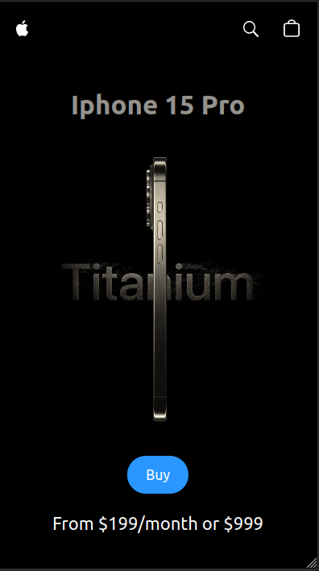
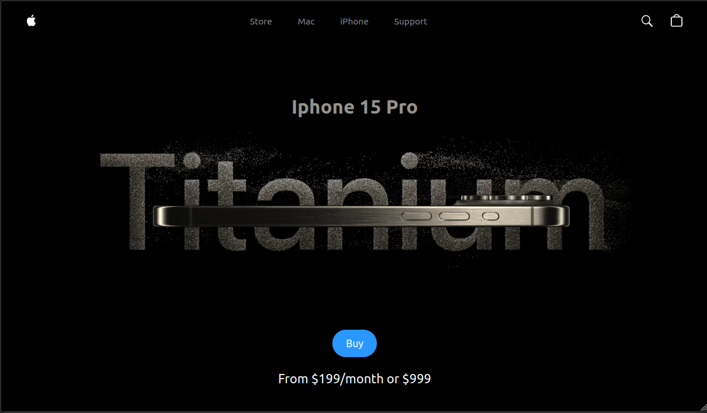

# Project: Clone Apple Iphone 15

Clone website of iPhone 15 Pro

### Use:

- This is a clone of Apple's iPhone 15 Pro website using React.js, TailwindCSS, GSAP (Greensock Animations) and Three.js .

#### 300px

#### 1100px

### Stack:

- Vite
- React.js
- Three.js
- React Three Fiber
- React Three Drei
- GSAP (Greensock)
- Tailwind CSS
- Node 18

### How to use:

1. Open the terminal ( cmd/terminal )
2. Clone the repository ( git clone git@github.com:RobMota/clone_website_iphone.git ) to a location of your choice
3. Access the folder ( cd clone_website_iphone)
4. And type the commands below:

- `npm install`
- `npm run dev`

### Original author

- Adrian Hajdin

### Project video on YouTube

